

# final-project-skeleton

**Team Number: 3**

**Team Name: Moodo**

| Team Member Name | Email Address          |
| ---------------- | ---------------------- |
| Houjie Xiong     | xhj@seas.upenn.edu     |
| Yisen Li         | yisen03@seas.upenn.edu |
| Zhihui Wang      | wang52@seas.upenn.edu  |

**GitHub Repository URL: https://github.com/upenn-embedded/final-project-f25-f25_final_project_t3.git**

**GitHub Pages Website URL:** [for final submission]*

## Final Project Proposal

### 1. Abstract

Our project “The Electronic Plant” aims to use sensor technology, such as light sensing, humidity, vibration, ultrasonic sensors, etc., to transform ordinary plants into electronic pets that can interact with people. This innovative product combines human-computer interaction technology, and personalized care functions to provide users with unique life companionship. In the design of the project, the core problem we have to solve is the choice of sensors and the realization of an intelligent operating system. For example, the application of a vibration sensor in the design of the leaf touch function. If the project is successful, those who lack the time but love plants and enjoy their company will be the beneficiaries. They just need a simple operation to enjoy the experience of communicating with plants and intelligent plant care.

### 2. Motivation

Some people may not enjoy noisy animal companions in today's fast-paced world for a variety of reasons, including the necessity to spend time and energy with their pets, financial strain, and so forth. Then, an additional choice is the electronic plant pet. In addition to being a significant component of the natural world, plants can calm and relax people on a psychological level. Unfortunately, many individuals find it challenging to monitor and take care of their plant pals due to the fast pace of modern life. Based on this circumstance, we created an intelligent electronics plant pet that aims to both alleviate the challenges that modern people face with plant upkeep and allow people to enjoy the delight of interacting with plants even indoors.

### 3. System Block Diagram

### 4. Design Sketches

* White housing
* Screen with cute expressions
* Audio with lovely response

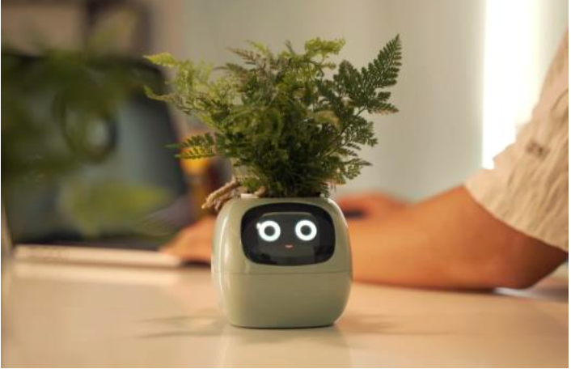

### 5. Software Requirements Specification (SRS)

**5.1 Definitions, Abbreviations**

* **UI**: User Interface.
* **OLED**: Organic LED display.
* **RTC**: Real-Time Clock.
* **Lux**: Illuminance unit used for light-level thresholds.
* **APP**: Phone pulls device data via Wi-Fi.

**5.2 Functionality**

| ID     | Description                                                                                                                                                                       |
| ------ | --------------------------------------------------------------------------------------------------------------------------------------------------------------------------------- |
| SRS-01 | On capacitive touch, play the corresponding voice prompt and switch the on-screen expression (≥95/100 touches correctly recognized; audio start latency ≤300 ms).               |
| SRS-02 | If a user remains within ≤60 cm for ≥1 hour, play a reminder every 30 s (timer-based; cadence error ≤±5%).                                                                    |
| SRS-03 | The OLED provides a face page and a data page; data page shows temperature, humidity, and time (page switch + data refresh period ≤2 s).                                         |
| SRS-04 | When lux falls below the “night” threshold, enter Night Mode and play a “good-night” prompt (configurable threshold; state-change hysteresis ≤2 s; false triggers ≤1/hour). |
| SRS-05 | Via ESP8266 HTTP, the phone can view T/H data (LAN end-to-end latency ≤3 s; packet loss ≤1% per 5 min).                                                                         |
| SRS-06 | On sensor anomalies, suppress actuators and report an error code (under injected faults, 100% of dangerous actions are suppressed).                                               |

### 6. Hardware Requirements Specification (HRS)

**6.1 Definitions, Abbreviations**

* **MCU** : ATmega328PB.
* **TWI (I²C) / SPI / UART** : On-chip serial interfaces.
* **LDO / 5 V / 3.3 V Rail** : Linear regulation and supply rails.
* **Ultrasonic (TRIG/ECHO)** : Ultrasonic ranging module with trigger/echo pins.

**6.2 Functionality**

| ID     | Description                                                                                                                |
| ------ | -------------------------------------------------------------------------------------------------------------------------- |
| HRS-01 | Use ATmega328PB Xplained Mini @16 MHz with at least 1×TWI, 1×UART, ADC, and a 16-bit timer/input-capture.                |
| HRS-02 | BH1750 + DS3231 over TWI; DHT11 on single-wire GPIO                                                                        |
| HRS-03 | One TRIG and one ECHO routed to MCU digital I/O and timer input-capture (20–200 cm average error ≤±2 cm).               |
| HRS-04 | Mini MP3 module + microSD, UART-controlled, feeding a small power amp and speaker (≥70 dB SPL at 1 m; UART BER ≤10⁻⁵). |
| HRS-05 | 0.96″ OLED (I²C or SPI) for face/data pages; status LEDs for network/fault (readable from 0–40 °C).                    |
| HRS-06 | ESP8266 over UART providing HTTP service.                                                                                  |
| HRS-07 | Enclosure/planter integrates cable channels; sensor wiring are routed and strain-relieved appropriately.                   |

### 7. Bill of Materials (BOM)

0.96″ OLED, SSD1306: Compact UI for Face/Data pages and status; enables ≤2 s page/refresh target (SRS-03/04; HRS-05).

Audio playback+ 8 Ω speaker: Deterministic playback of prompts for touch/scene reminders; meets 70 dB at 1 m (SRS-01/02; HRS-04).

BH1750 Lux sensor: Stable digital lux measurement for Night or Day scene switching with hysteresis (SRS-04; HRS-02).

SHT31-D temperature and humidity: Higher accuracy and faster response than DHT-class sensors; shares the I²C bus to simplify wiring and timing (SRS-03/05; HRS-02).

DS3231 RTC: Accurate timekeeping for on-device clock and timestamps (SRS-04/06; HRS-02).

Ultrasonic distance sensor: Presence or sedentary detection around 20–200 cm with timer capture accuracy (SRS-02; HRS-03).

ESP8266 Wi-Fi module: On-device HTTP endpoint for real-time phone readouts (latency ≤3 s; SRS-05; HRS-06).

Bi-directional logic-level converter: Protects the ESP8266 RX from 5 V MCU TX; robust signal integrity (SRS-06; HRS-06/07).

[ESE5190 F25 Final Project BOM](https://docs.google.com/spreadsheets/d/1nHNS6sTaiRxIfIU2DxsQ8JMAf2BlR0g4Ui7gQNSghIs/edit?usp=sharing)

### 8. Final Demo Goals

Our project is a desk device, so we can directly show the function of our device. We will demonstrate our device's morning and evening greeting function by changing the brightness of the light, the mood change, sound playback and display function of plants by touching them. Besides, We will show our device's health reminder function by sitting for a short period of time.

### 9. Sprint Planning

| Milestone  | Functionality Achieved                                         | Distribution of Work                                                         |
| ---------- | -------------------------------------------------------------- | ---------------------------------------------------------------------------- |
| Sprint #1  | morning and evening greeting function                          | 1. purchasing devide and writting report; 2. software part; 3. hardware part |
| Sprint #2  | the mood change, sound playback and display function of plants | 1. purchasing devide and writting report; 2. software part; 3. hardware part |
| MVP Demo   | health reminder function                                       | 1. purchasing devide and writting report; 2. software part; 3. hardware part |
| Final Demo | Equipment hardware assembly and testing                        | 1. purchasing devide and writting report; 2. slides; 3. hardware part        |

**This is the end of the Project Proposal section. The remaining sections will be filled out based on the milestone schedule.**

## First Week Sprint Review #1

This week we inspected and tested the existing equipments in the lab, checking their datasheets to ensure that the equipment was applicable. We also completed the basic functional implementation and individual testing of the Temperature & Humidity Sensor Breakout Board and music maker with speaker.

### last week's progress

#### 1. Examine part from lab works

To save costs, reduce unnecessary waiting time for device shipments, and make full use of existing laboratory resources, we identified several devices suitable for our project during our experiments and verified their applicability with datasheets.

##### SHT20 - Temperature & Humidity Sensor:

We found a SHT20 from labs, which integrates a capacitive humidity sensor and a precision temperature sensor with on-chip signal processing and factory calibration, and provides fully digital output over an I²C interface. According to the AHT20 datasheet, it supports a 2.0–5.5 V supply voltage, a 0–100 %RH humidity range, a –40 to +85 °C temperature range, and typical accuracies of ±2 %RH and ±0.3 °C. These characteristics make it significantly more capable than low-cost sensors such as DHT11, and very well matched for our ATmega32PB-based system: it is accurate, low-power, and easy to interface. Functionally, the HT20 is used to detect ambient temperature and humidity, enabling interactive functions such as reminding users to dress or drink water. It also works in conjunction with soil moisture detection to determine when to water plants.

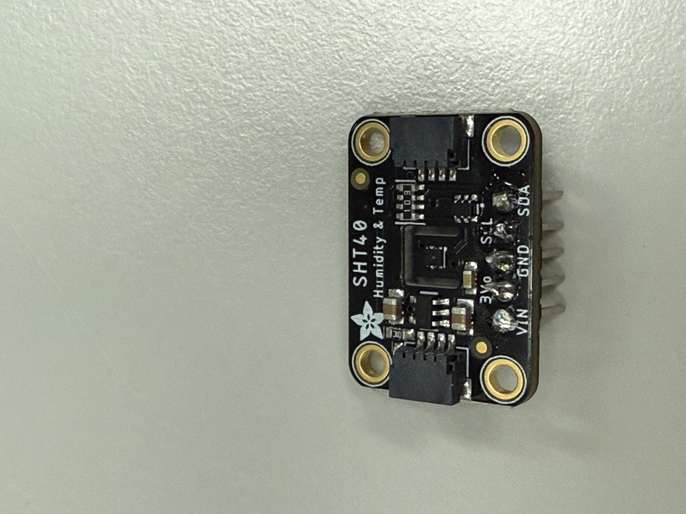
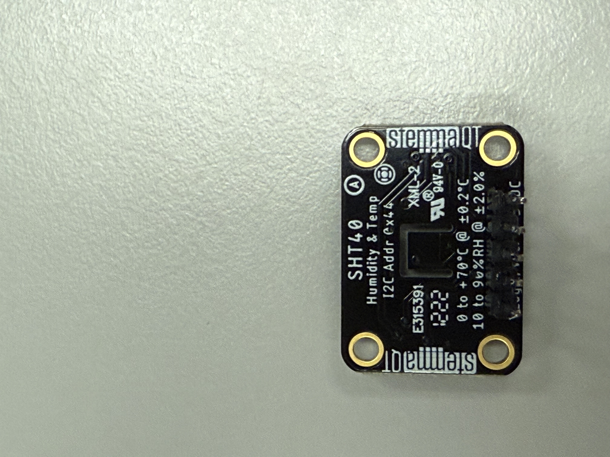

(test code: SHT_humiAndTemp_test.c)

Video:
[humidity and temperature sensor](https://drive.google.com/file/d/1q-K4fy1wZYKdtjqaLBNcZiMGyouqcFei/view?usp=sharing)

##### Adafruit Audio FX Sound Board + 2x2W Amp (16 MB)

The Adafruit Audio FX Sound Board + 2x2W Amp (16 MB) is suitable to be used as the main audio module to play voice prompts and sound effects for the “electronic plant plot”. According to the Adafruit documentation, this board is a stand-alone audio effects trigger with on-board flash storage, up to 11 trigger inputs, built-in 2×2 W class-D amplifier, and support for WAV/OGG audio at up to 44.1 kHz / 16-bit stereo. This makes it very suitable for our system, because we only need simple, reliable sound playback instead of a complex audio codec + MCU software stack. The board also supports different trigger behaviours simply by changing the file name pattern. so we can implement rich sound interactions without extra firmware complexity. Functionally, we can use it in conjunction with a speaker to play various interactive sound effects.

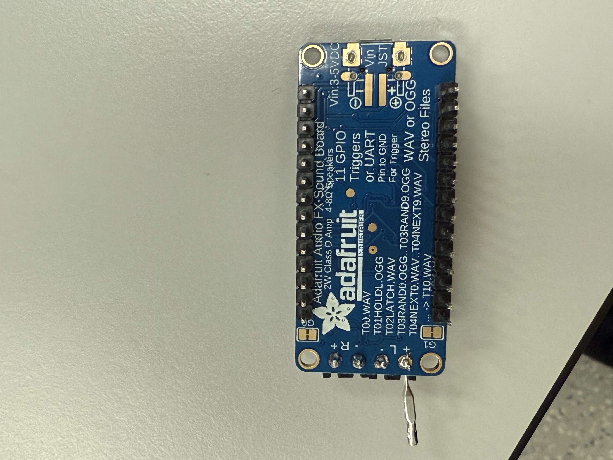

(test code: Speaker_test.c)

Video:
[music maker with speaker](https://drive.google.com/file/d/1XzJ54Gmg9IRC7lquxUHrpikLp9J229z9/view?usp=sharing)

##### Soil Moisture Sensor

After testing, we also found a ST0160 Soil Moisture Sensor Platform Evaluation Expansion Board to measure the soil moisture level in the plant pot. According to the product datasheet, ST0160 is a capacitive soil moisture sensor with an on-board interface board that provides an analog voltage output proportional to soil moisture, powered from 3.3 V or 5 V and using a simple 3-pin PH2.54 connector (VCC, GND, AO). This makes it very easy for our ATmega32PB-based system, which already has multiple ADC channels for analog sensing. This sensor is used to detect soil moisture to determine when to water, and can also visualize the soil condition on a screen.

### Current state of our project

This week, we examine three parts we got from lab. And we are good to continue to build the main program. We brainstorm the blueprint of our project and clear that what we need to do for next week.

### Next weeks's plan

Minimal reuqirement:
Since we have already tested out soundboard and humidity & temerature sensor, we are good to start writing the skleton code for out system. Thus, if we cannot get our OLED driver and screen, we will write the program that output the sensor readings to uart.

Desired result:
If we can get our ordered stuffs by next week, we should work on more individual testing and assigned ports. After doing that, we also need to start working on the main program. This week we have tested funtionality of three parts, we also need to finalize and write the individual functions as part of main program.
Also we need to start thinking of the housing problem and do we need 3d printing for our final product.

### 5. Personal task

Zhihui: Design the mood system and interactive sentences & 3D printing model.
Houjie: Integrate Temperature & Humidity Sensor and Sound Board codes.
Yisen:  OLED driver and display.

## Second Week Sprint Review #2

This week we finished most of the core features. For example, when a person walks up to our e-pet it plays a greeting, if you stay nearby for a while it gently reminds
you to stand up and move around, and if you leave for some time it says it’s going to sleep. We also implemented facial expression changes and an automatic watering
function based on the overall air humidity.

### Last week's progress

After receiving the parts we ordered online, we began integrating the full system. Our key accomplishments include:

1. Design overall system frame work.
2. Adding the real-time clock and radar sensors into the project.
3. Writing the plant’s dialogue lines and converting them into OGG audio files.

Wendsday - Thursday

1. Adding a display module to show the plant’s emotion, current time, and environmental data such as temperature.
2. Integrating the water pump into the system.

#### 1. software code framework

We updated our system block diagram as shown below. (We actually got some inspiration from the structure of the Lab4: Ping Pong game design.)

#### 1. Sensor

RTC: Our RTC communicates over I²C and shares the SCL/SDA bus with the SHT40 temperature and humidity sensor. Since each device has a unique address,
both can operate on the same lines without conflict. The system reads sensor data once every second using this shared bus.
Radar: We reused the radar sensing code from previous labs. It allows us to detect user presence and movement around the desk.

#### 2. sound

We designed logic that triggers different voice lines based on sensor readings and user behavior:

Greeting: Triggered when the radar first detects a person approaching.

Inactivity Reminder: If the user remains seated for too long, the e-pet gently reminds them to stretch, stand up, or drink water.

Light On/Off: Responds to sudden changes in brightness detected by the photoresistor.

Thirsty Alert: When humidity drops below a threshold, it plays a reminder indicating that the plant needs water.

#### 3. Emotion and Text display

This week we use SHT20 - Temperature & Humidity Sensor Breakout Board measure temperature and humidity in the environment, showing them on the TFT screen by designing text display function as we planned last week. On the time display module, we use RTC to obtain the time and update it on the screen. At the same time, we receive 800x480 TFT Display and its diver. We read though datasheet and designed the emotion_set function using a square of length 13 as a single pixel block to complete the drawing of the six types expression, including normal type, happy type, thirsty type, hot type, cold type and sleepy type. We adjust facial expressions based on data from temperature and humidity sensors: when the temperature is above 25 degrees Celsius and below 28 degrees Celsius, and the humidity is between 60% and 90%, we consider this the most comfortable state and set the expression to "happy." When the temperature is above35 degrees Celsius, we consider it hot and set the expression to "hot," while when the temperature is below 10 degrees Celsius, we set the expression to "cold." When the humidity is below 45%, we consider plants are prone to dehydration and set the expression to "thirsty" to remind people to water their plants. We use a photoresistor to measure room brightness; when the brightness is below 250, we consider the room lights to be off and people to be preparing to rest, and set the expression to "sleepy."

During this process, we encountered a problem where emoticons and text information such as temperature, humidity, and time could not be displayed on the screen simultaneously. The main cause of this problem was SRAM memory overflow. When displaying emoticons, our emoticon bitmaps exhausted the microcontroller's SRAM, causing a stack crash, which in turn led to abnormal text display. Therefore, we forced all emoticon bitmaps to be stored in Flash (PROGMEM) to alleviate SRAM memory pressure and enable normal display of emoticons and text.

### Proof of work (Videos):

[Overall_demo](https://drive.google.com/file/d/1iuXEkUR4mMYZO9jE3Tct6t_s6aiQ9kYX/view?usp=drive_link)
[Pump_demo](https://drive.google.com/file/d/1plHgSSInf7cWM5uCJOrK-Lp3wiClO9bW/view?usp=drive_link)
[Sound_demo](https://drive.google.com/file/d/1k7FcTN9usqtEiQa2bPilFarPoeD4-l_D/view?usp=drive_link)

### Current state of our project

Most of the coding is complete, and the full circuit is assembled and functional. The system can read sensors, display emotions, play audio, and perform the automatic watering behavior.

### Next weeks's plan

Finalize and polish the remaining logic and resolve minor bugs. (we slightly changes the threshold for the demo purpose)

Begin designing and building the physical housing for the system. Currently, all circuitry is exposed, which is not ideal for the final presentation.

Continue refining the emotional logic and display performance. If we can add animation that will be perfect

### Personal task

Zhihui: Design Housing plan
Houjie: refine coding logics
Yisen: Soldering connections.

## MVP Demo Report - Team 3 Moodo

### 1. Show a system block diagram & explain the hardware implementation.

Below is our hardware connection diagram.
For simplicity, the RA8875 driver and the LCD module are shown as an integrated unit using a single 40-pin TFT connector.
The soundboard and speaker are connected via their signal line, 5V power, and ground.
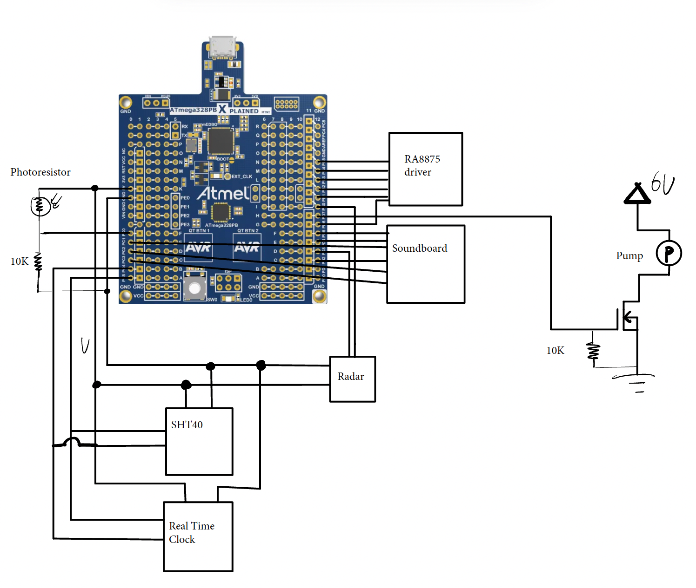

### 2. Explain your firmware implementation, including application logic and critical drivers you've written.

Our firmware is organized as a simple loop running at ~1 Hz, with all time-critical sensing handled by hardware peripherals and interrupts.

The init() routine configures the core drivers (UART, I2C/TWI, SPI LCD, ADC, timers, and GPIOs), and the while(1) loop periodically polls sensors, updates sensor reading variables (light, distance, humidity), triggers sounds, changes LCD display and runs the pump scheduler. Based on the sensor readings, the system determines Moodo’s mood. Emotion display updates only when mood changes, avoiding unnecessary redraws.”

After initialization, we play a power-up greeting (SOUND_HELLO) and then enter the main loop, which performs one full sensing/logic cycle per second (_delay_ms(1000)). Each loop (~1 s) performs the following:

1. Update environment (temperature, humidity, light).
2. Light logic: detect LIGHT_ON / LIGHT_OFF transitions and trigger sleep sound after prolonged darkness.
3. Humidity logic: from non-dry → dry, play “THIRSTY.”
4. Distance logic: near → greet the user; prolonged near → “STAND UP;” far after interaction → “SLEEP.”
5. Mood computation: decide_mood() maps environmental conditions to one of six moods (sleep, happy, hot, cold, thirsty, normal).
6. LCD update: refreshes emotion graphics and displays time + sensor values.
7. Pump scheduling: simple time-based cycle toggling PD7 to water the plant periodically

Driver files:
ds1307: Real-time clock driver. Handles issuing periodic I²C commands and reading the current time from the DS1307 RTC module.

ra8875_drv.h / ra8875_gfx: Low-level RA8875 display controller driver and higher-level graphics utilities. These files provide primitives such as drawing pixels, lines, text, and handling screen updates for the TFT LCD.

twi0.h: Implements the I²C (TWI0) interface used for communication with devices such as the SHT40 sensor and DS1307 RTC.

uart.h: UART serial driver. Not required for final functionality, but included during development to enable debugging via printf and serial logging.

sht40.h: Driver for the SHT40 temperature and humidity sensor. Integrates command transmission, data acquisition, and conversion of raw sensor readings into physical values.

### 3. Video Demo.

[Overall_demo](https://drive.google.com/file/d/1iuXEkUR4mMYZO9jE3Tct6t_s6aiQ9kYX/view?usp=drive_link)

[Pump_demo](https://drive.google.com/file/d/1plHgSSInf7cWM5uCJOrK-Lp3wiClO9bW/view?usp=drive_link)

[Sound_demo](https://drive.google.com/file/d/1k7FcTN9usqtEiQa2bPilFarPoeD4-l_D/view?usp=drive_link)

### 4. Have you achieved some or all of your Software Requirements Specification (SRS)?

**Functionality**

| ID     | Description                                                                                                                                                                       | Validation Outcome                                                                                                                                                                                                 |
| ------ | --------------------------------------------------------------------------------------------------------------------------------------------------------------------------------- | ------------------------------------------------------------------------------------------------------------------------------------------------------------------------------------------------------------------ |
| SRS-01 | On capacitive touch, play the corresponding voice prompt and switch the on-screen expression (≥95/100 touches correctly recognized; audio start latency ≤300 ms).               | **Failed.** Adding a capacitive touchscreen exceeded our hardware budget, so this feature was not implemented                                                                                                |
| SRS-02 | If a user remains within ≤60 cm for ≥1 hour, play a reminder (timer-based; cadence error ≤±5s).                                                                               | **Confirmed.** The RTC has been validated with a 1 s/hour cadence error which meet our requirement, and the system successfully triggers a voice reminder when the user stays nearby for an extended period. |
| SRS-03 | The LCD provides a face page and a data page; data page shows temperature, humidity, and time (page switch + data refresh period ≤2 s).                                          | **Confirmed.** Temperature and humidity readings update accurately, and the data refresh cycle is now 1 second.                                                                                              |
| SRS-04 | When lux falls below the “night” threshold, enter Night Mode and play a “good-night” prompt (configurable threshold; state-change hysteresis ≤2 s; false triggers ≤1/hour). | **Confirmed.** The system now reliably detects light-intensity changes and transitions into Night Mode as expected.                                                                                          |
| SRS-05 | Via ESP8266 HTTP, the phone can view T/H data (LAN end-to-end latency ≤3 s; packet loss ≤1% per 5 min).                                                                         | **Failed. Wireless connectivity was not implemented because all available pins are already allocated for other essential modules, so the system currently operates locally only.**                           |

### 5. Have you achieved some or all of your Hardware Requirements Specification (HRS)?

| ID     | Description                                                                                                                | Validation Outcome                                        |
| ------ | -------------------------------------------------------------------------------------------------------------------------- | --------------------------------------------------------- |
| HRS-01 | Use ATmega328PB Xplained Mini @16 MHz with at least 1×TWI, 1×UART, ADC, and a 16-bit timer/input-capture.                | **Confirmed**                                       |
| HRS-03 | One TRIG and one ECHO routed to MCU digital I/O and timer input-capture (20–200 cm average error ≤±2 cm).               | **Confirmed**                                       |
| HRS-04 | Mini MP3 module + microSD, UART-controlled, feeding a small power amp and speaker (≥70 dB SPL at 1 m; UART BER ≤10⁻⁵). | Achieved. (no micro SD need, soundboard has a 16MB flash) |
| HRS-05 | 0.96″ OLED (I²C or SPI) for face/data pages; status LEDs for network/fault (readable from 0–40 °C).                    | **Confirmed**. We upgrade to a 5.0" LCD display     |
| HRS-06 | ESP8266 over UART providing HTTP service.                                                                                  | Failed                                                    |
| HRS-07 | Enclosure/planter integrates cable channels; sensor wiring are routed and strain-relieved appropriately.                   | **Not completed yet.**                              |

### 6. Show how you collected data and the outcomes.

**Real-Time Clock (RTC):**
To verify the accuracy of the RTC, we used a smartphone clock as the reference time source. Across three separate one-hour tests, the RTC’s drift remained within ±1 second per hour, which meets our timing precision requirement.

**Light Intensity Sensor:**
We evaluated the light sensor by manually blocking it with a finger and observing its response to sudden changes in illumination—it reacted instantly. We also turned off all room light sources to simulate nighttime conditions. Under these conditions, the analog reading consistently dropped below 300, so we set 300 as the threshold between “day mode” and “night mode.” This threshold is stable and repeatable across our tests.

**Temperature and Humidity Sensor:**
Although we lack laboratory-grade equipment for absolute accuracy validation, we verified the sensor qualitatively. The readings remained stable and reasonable during normal operation. When a finger was brought close to the sensor, both temperature and humidity increased gradually, as expected. However, we currently cannot quantify the measurement error or test cold-side accuracy.

**Ultrasonic (Distance Sensor):**
We tested the ultrasonic sensor at multiple distance ranges: 10–50 cm, 50–100 cm, and 100–200 cm.

1. At 10–50 cm, performance was excellent with errors within ±3 cm.
2. At 50–100 cm, errors increased to 5–15 cm.
3. At 100–200 cm, the error margin grew to 20–30 cm.
   These results match the typical behavior of low-cost ultrasonic modules, where accuracy decreases with distance

### 7. Show off the remaining elements that will make your project whole: mechanical casework, supporting graphical user interface (GUI), web portal, etc.

**Mechanical Casework:**
We will design a protective enclosure that prevents any circuits from being exposed to the user. The case will also improve the overall reliability by reinforcing the physical connections between the ATmega328PB and all attached modules.

**Connection & Structural Improvements:**
Our goal is to move away from breadboards and loose jumper wires, replacing them with more secure and permanent wiring to ensure stable long-term operation.

**Power Solution:**
Currently, the ATmega328PB and water pump are powered through a laptop and an external power supply. For the final build, we plan to use a power bank to simulate a self-contained, battery-powered system, allowing our project to operate safely, portably, and independently without external equipment.

### 8. What is the riskiest part remaining of your project?

Our enclosure must be waterproof, because unlike many other projects, our system includes an active watering mechanism. Even a single drop of water contacting the exposed circuit or metal connections could cause short-circuiting and permanently damage the electronics.

### 9. How do you plan to de-risk this?

Therefore, it is essential for us to design a safe, sealed, and reliable protective enclosure that prevents water while still maintaining a clean, simple, and appealing appearance. In addition, we plan to eliminate the use of breadboards and jumper wires, as they are prone to loose connections and are not suitable for long-term stability. Instead, we will transition to more secure and permanent wiring solutions to ensure robustness and safety in the final system.

### 10. What questions or help do you need from the teaching team?

What are some recommended approaches or best practices for building a stable, safe, and portable power system for our ATmega328PB and pump?

## Final Project Report

webpage: https://upenn-embedded.github.io/final-project-website-submission-f25-t03-f25-moodo/

Don't forget to make the GitHub pages public website!
If you’ve never made a GitHub pages website before, you can follow this webpage (though, substitute your final project repository for the GitHub username one in the quickstart guide):  [https://docs.github.com/en/pages/quickstart](https://docs.github.com/en/pages/quickstart)

### 1. Video

https://drive.google.com/file/d/1tba6R1UWRpnd1wjd9sBgCogl1hPzVUH_/view?usp=drivesdk

### 2. Images

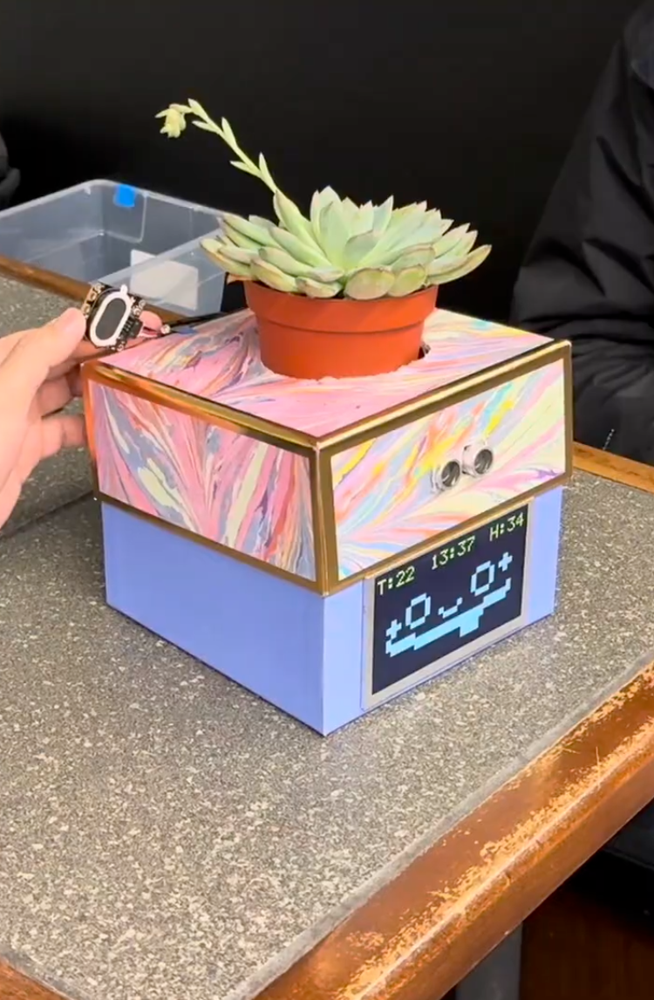

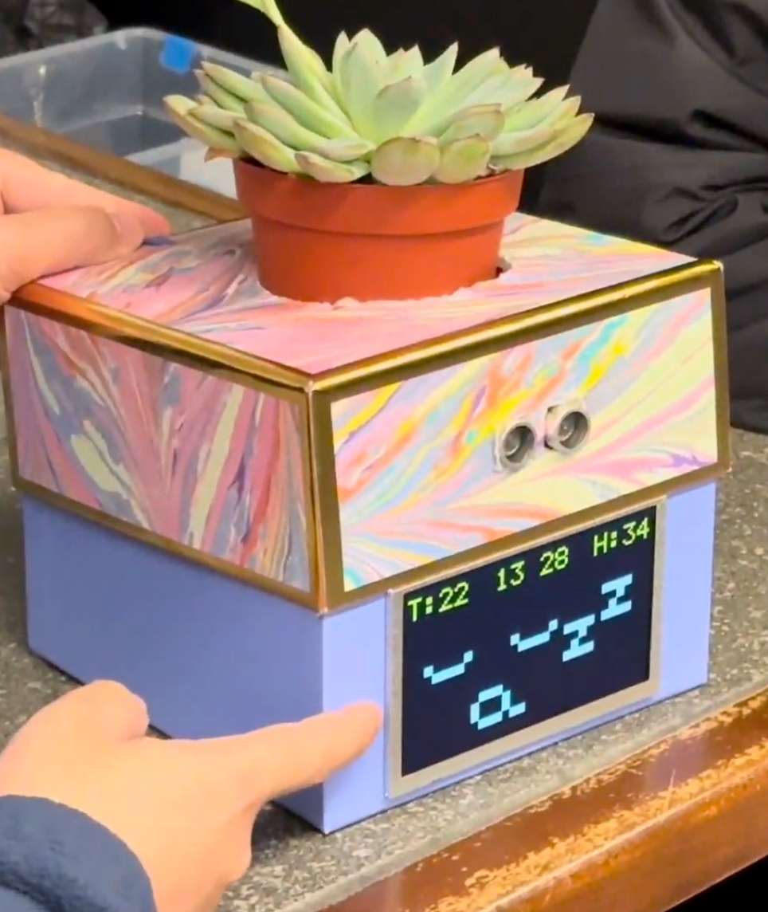

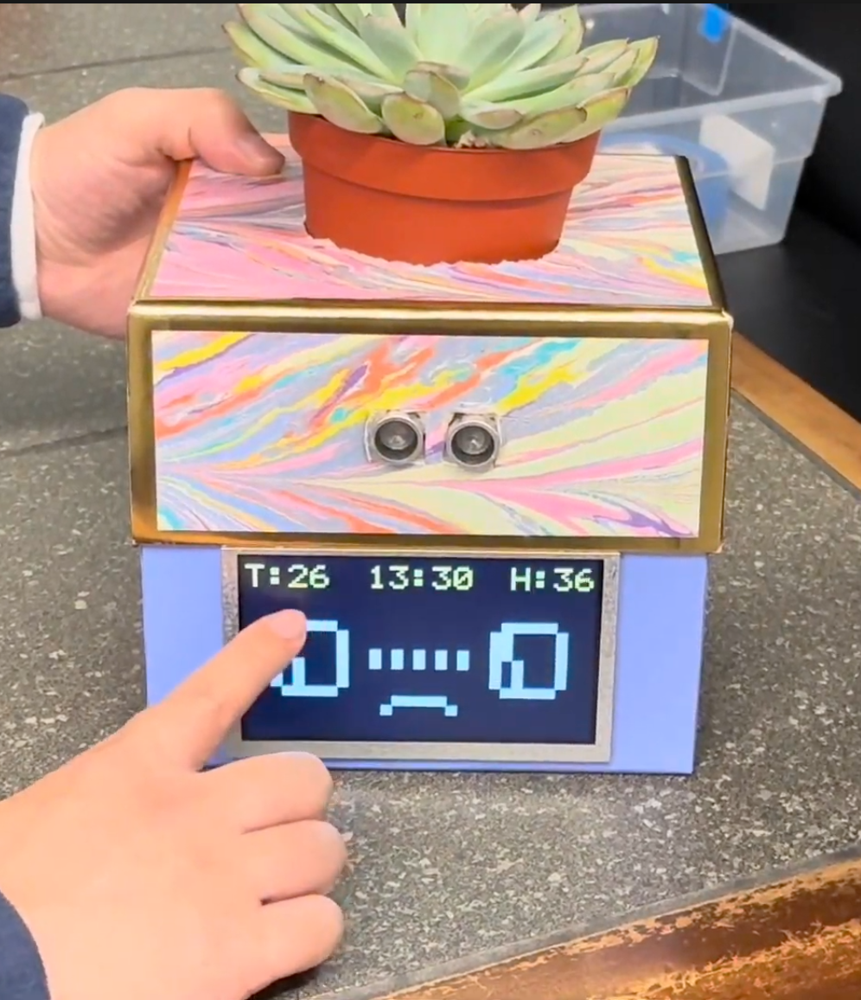

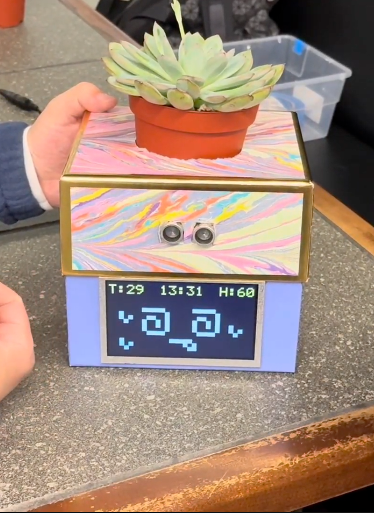

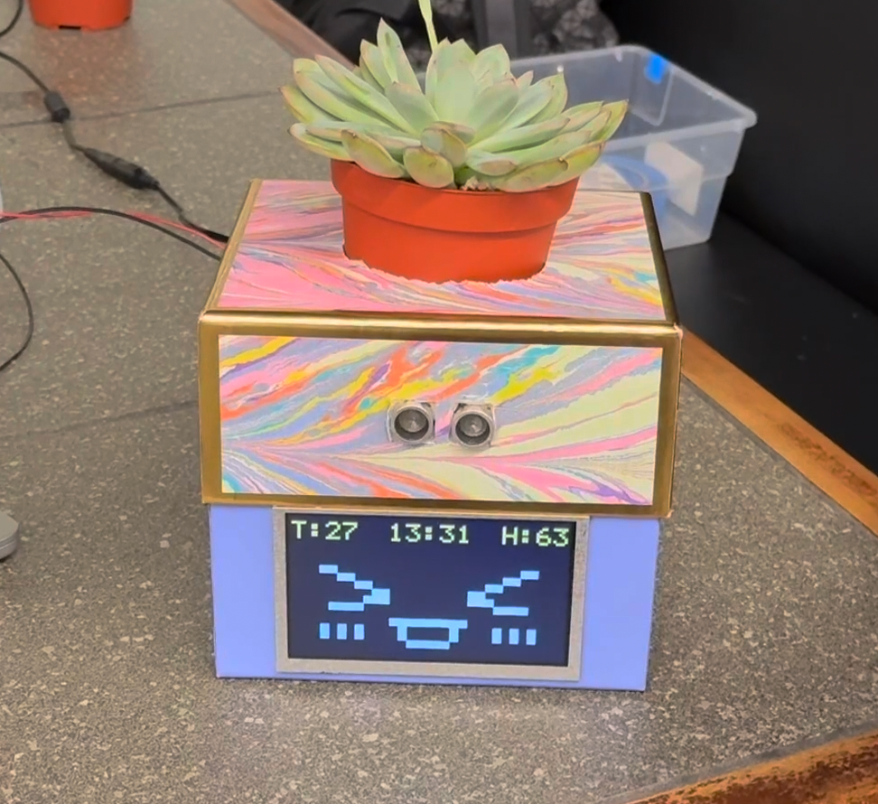

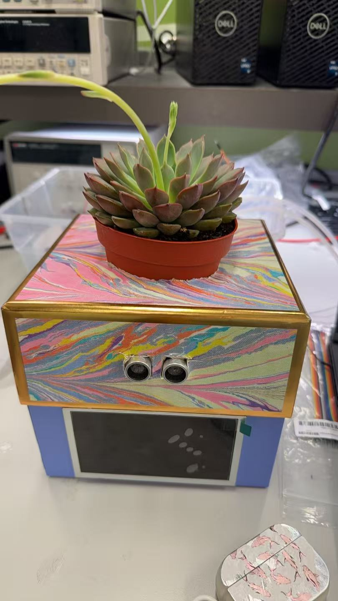

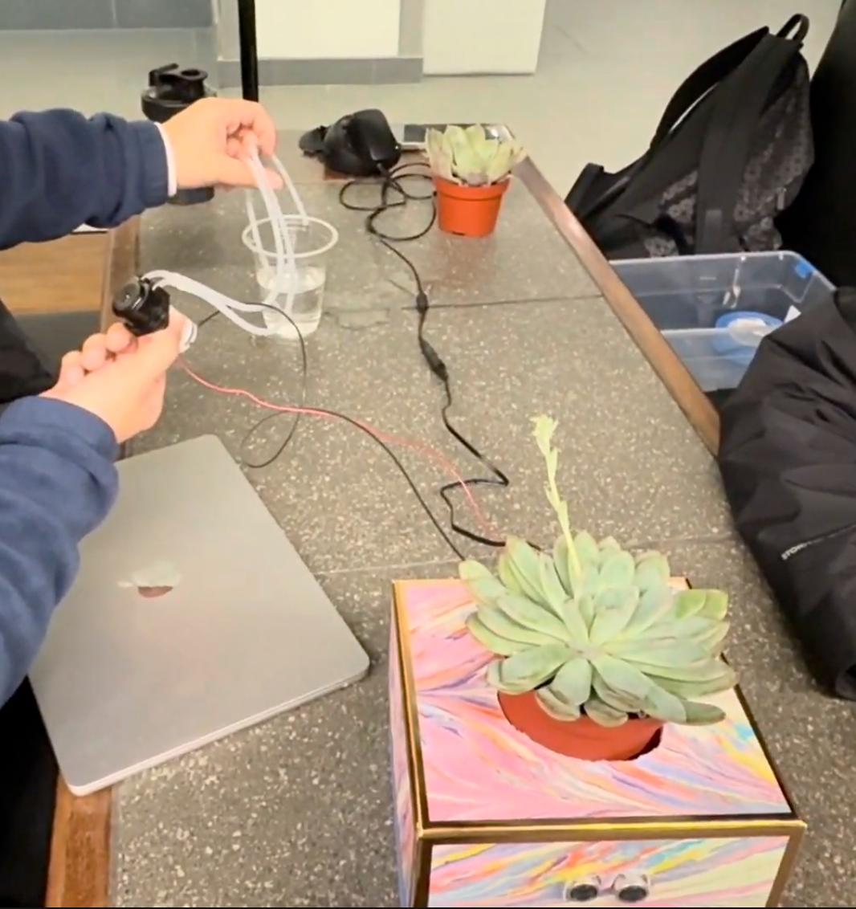

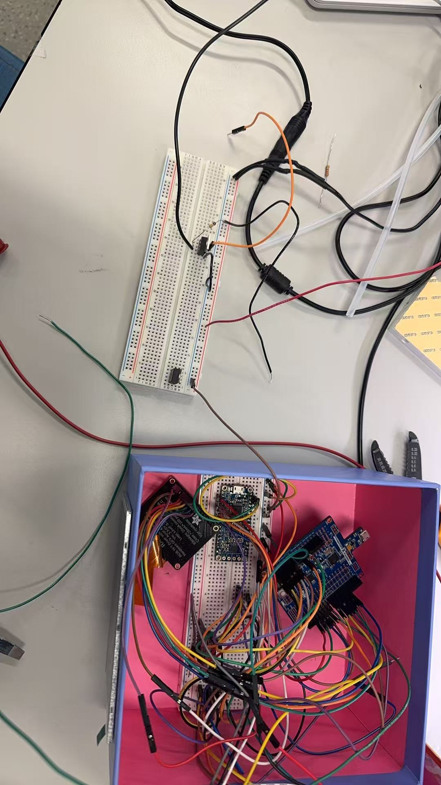

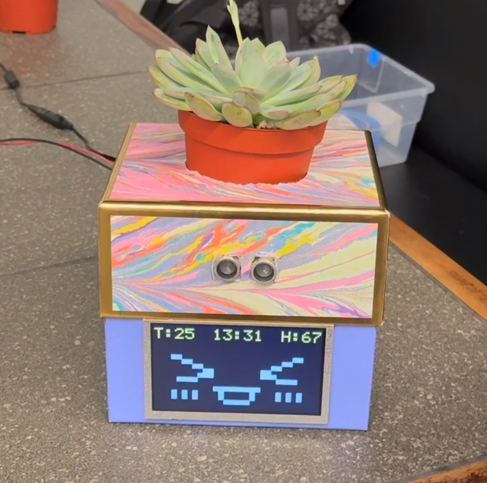

### 3. Results

#### 3.1 Software Requirements Specification (SRS) Results

| ID     | Description                                                                                                                                                                       | Validation Outcome                                                                                                                                                                                                 |
| ------ | --------------------------------------------------------------------------------------------------------------------------------------------------------------------------------- | ------------------------------------------------------------------------------------------------------------------------------------------------------------------------------------------------------------------ |
| SRS-01 | If a user remains within ≤60 cm for ≥1 hour, play a reminder (timer-based; cadence error ≤±5s).                                                                               | **Confirmed.** The RTC has been validated with a 1 s/hour cadence error which meet our requirement, and the system successfully triggers a voice reminder when the user stays nearby for an extended period. |
| SRS-02 | The LCD provides a face page and a data page; data page shows temperature, humidity, and time (page switch + data refresh period ≤2 s).                                          | **Confirmed.** Temperature and humidity readings update accurately, and the data refresh cycle is now 1 second.                                                                                              |
| SRS-03 | When lux falls below the “night” threshold, enter Night Mode and play a “good-night” prompt (configurable threshold; state-change hysteresis ≤2 s; false triggers ≤1/hour). | **Confirmed.** The system now reliably detects light-intensity changes and transitions into Night Mode as expected.                                                                                          |

**Real-Time Clock (RTC):**
To verify the accuracy of the RTC, we used a smartphone clock as the reference time source. Across three separate one-hour tests, the RTC’s drift remained within ±1 second per hour, which meets our timing precision requirement.

**Light Intensity Sensor:**
We evaluated the light sensor by manually blocking it with a finger and observing its response to sudden changes in illumination—it reacted instantly. We also turned off all room light sources to simulate nighttime conditions. Under these conditions, the analog reading consistently dropped below 300, so we set 300 as the threshold between “day mode” and “night mode.” This threshold is stable and repeatable across our tests.

**Temperature and Humidity Sensor:**
Although we lack laboratory-grade equipment for absolute accuracy validation, we verified the sensor qualitatively. The readings remained stable and reasonable during normal operation. When a finger was brought close to the sensor, both temperature and humidity increased gradually, as expected. However, we currently cannot quantify the measurement error or test cold-side accuracy.

**Ultrasonic (Distance Sensor):**
We tested the ultrasonic sensor at multiple distance ranges: 10–50 cm, 50–100 cm, and 100–200 cm.

1. At 10–50 cm, performance was excellent with errors within ±3 cm.
2. At 50–100 cm, errors increased to 5–15 cm.
3. At 100–200 cm, the error margin grew to 20–30 cm.
   These results match the typical behavior of low-cost ultrasonic modules, where accuracy decreases with distance

#### 3.2 Hardware Requirements Specification (HRS) Results

| ID     | Description                                                                                                                | Validation Outcome                                        |
| ------ | -------------------------------------------------------------------------------------------------------------------------- | --------------------------------------------------------- |
| HRS-01 | Use ATmega328PB Xplained Mini @16 MHz with at least 1×TWI, 1×UART, ADC, and a 16-bit timer/input-capture.                | **Confirmed**                                       |
| HRS-02 | One TRIG and one ECHO routed to MCU digital I/O and timer input-capture (20–200 cm average error ≤±2 cm).               | **Confirmed**                                       |
| HRS-03 | Mini MP3 module + microSD, UART-controlled, feeding a small power amp and speaker (≥70 dB SPL at 1 m; UART BER ≤10⁻⁵). | Achieved. (no micro SD need, soundboard has a 16MB flash) |
| HRS-04 | 0.96″ OLED (I²C or SPI) for face/data pages; status LEDs for network/fault (readable from 0–40 °C).                    | **Confirmed**. We upgrade to a 5.0" LCD display     |

### 4. Conclusion

Our project “The Electronic Plant” aims to use sensor technology, such as light sensing, humidity, vibration, ultrasonic sensors, etc., to transform ordinary plants into electronic pets that can interact with people. Our core features include: when a person walks up to our e-pet it plays a greeting, if you stay nearby for a while it gently reminds you to stand up and move around, and if you leave for some time it says it’s going to sleep. We also implemented facial expression changes and an automatic watering function based on the overall air humidity.

Throughout the project, we learned a lot about integrating multiple sensors and modules into a cohesive system. We faced challenges in ensuring reliable communication between components and managing power consumption effectively. We are proud of achieving smooth integration across multiple subsystems—sensing, audio, display, and user interaction. We successfully ran the RTC and SHT40 on a shared I²C bus, implemented responsive voice-line logic, and designed six emotion expressions mapped to real environmental conditions. Most importantly, we solved a major SRAM overflow issue by moving all bitmap data into Flash (PROGMEM), allowing the TFT screen to display both text and emoticons reliably. This debugging and system-level optimization was a significant accomplishment for our team.

Our enclosure must be waterproof, because unlike many other projects, our system includes an active watering mechanism. Even a single drop of water contacting the exposed circuit or metal connections could cause short-circuiting and permanently damage the electronics. Therefore, it is essential for us to design a safe, sealed, and reliable protective enclosure that prevents water while still maintaining a clean, simple, and appealing appearance. In addition, we plan to eliminate the use of breadboards and jumper wires, as they are prone to loose connections and are not suitable for long-term stability. We transition to more secure and permanent wiring solutions to ensure robustness and safety in the final system.

## References

Adafruit_RA8875.cpp

Adafruit_RA8875.h
