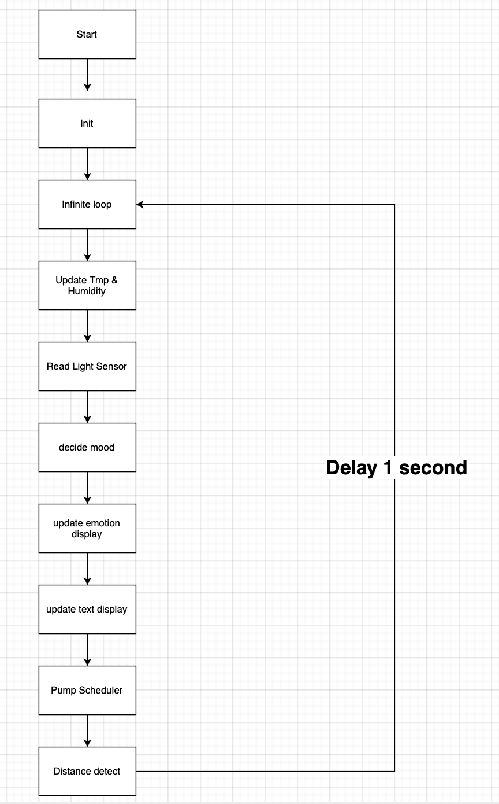

## Second Week Sprint Review #2

This week we finished most of the core features. For example, when a person walks up to our e-pet it plays a greeting, if you stay nearby for a while it gently reminds 
you to stand up and move around, and if you leave for some time it says it’s going to sleep. We also implemented facial expression changes and an automatic watering 
function based on the overall air humidity.

### Last week's progress

After receiving the parts we ordered online, we began integrating the full system. Our key accomplishments include:
1. Design overall system frame work.
2. Adding the real-time clock and radar sensors into the project.
3. Writing the plant’s dialogue lines and converting them into OGG audio files. 

Wendsday - Thursday 
1. Adding a display module to show the plant’s emotion, current time, and environmental data such as temperature.
2. Integrating the water pump into the system.

#### 1. software code framework 
We updated our system block diagram as shown below. (We actually got some inspiration from the structure of the Lab4: Ping Pong game design.)

#### 1. Sensor
RTC: Our RTC communicates over I²C and shares the SCL/SDA bus with the SHT40 temperature and humidity sensor. Since each device has a unique address,
both can operate on the same lines without conflict. The system reads sensor data once every second using this shared bus.
Radar: We reused the radar sensing code from previous labs. It allows us to detect user presence and movement around the desk. 

#### 2. sound

We designed logic that triggers different voice lines based on sensor readings and user behavior:

Greeting: Triggered when the radar first detects a person approaching.

Inactivity Reminder: If the user remains seated for too long, the e-pet gently reminds them to stretch, stand up, or drink water.

Light On/Off: Responds to sudden changes in brightness detected by the photoresistor.

Thirsty Alert: When humidity drops below a threshold, it plays a reminder indicating that the plant needs water.

#### 3. Emotion and Text display
This week we use SHT20 - Temperature & Humidity Sensor Breakout Board measure temperature and humidity in the environment, showing them on the TFT screen by designing text display function as we planned last week. On the time display module, we use RTC to obtain the time and update it on the screen. At the same time, we receive 800x480 TFT Display and its diver. We read though datasheet and designed the emotion_set function using a square of length 13 as a single pixel block to complete the drawing of the six types expression, including normal type, happy type, thirsty type, hot type, cold type and sleepy type. We adjust facial expressions based on data from temperature and humidity sensors: when the temperature is above 25 degrees Celsius and below 28 degrees Celsius, and the humidity is between 60% and 90%, we consider this the most comfortable state and set the expression to "happy." When the temperature is above35 degrees Celsius, we consider it hot and set the expression to "hot," while when the temperature is below 10 degrees Celsius, we set the expression to "cold." When the humidity is below 45%, we consider plants are prone to dehydration and set the expression to "thirsty" to remind people to water their plants. We use a photoresistor to measure room brightness; when the brightness is below 250, we consider the room lights to be off and people to be preparing to rest, and set the expression to "sleepy."

During this process, we encountered a problem where emoticons and text information such as temperature, humidity, and time could not be displayed on the screen simultaneously. The main cause of this problem was SRAM memory overflow. When displaying emoticons, our emoticon bitmaps exhausted the microcontroller's SRAM, causing a stack crash, which in turn led to abnormal text display. Therefore, we forced all emoticon bitmaps to be stored in Flash (PROGMEM) to alleviate SRAM memory pressure and enable normal display of emoticons and text.

### Proof of work (Videos):
[Overall_demo](https://drive.google.com/file/d/1iuXEkUR4mMYZO9jE3Tct6t_s6aiQ9kYX/view?usp=drive_link)
[Pump_demo](https://drive.google.com/file/d/1plHgSSInf7cWM5uCJOrK-Lp3wiClO9bW/view?usp=drive_link)
[Sound_demo](https://drive.google.com/file/d/1k7FcTN9usqtEiQa2bPilFarPoeD4-l_D/view?usp=drive_link)

### Current state of our project 

Most of the coding is complete, and the full circuit is assembled and functional. The system can read sensors, display emotions, play audio, and perform the automatic watering behavior.

### Next weeks's plan
Finalize and polish the remaining logic and resolve minor bugs. (we slightly changes the threshold for the demo purpose)

Begin designing and building the physical housing for the system. Currently, all circuitry is exposed, which is not ideal for the final presentation.

Continue refining the emotional logic and display performance. If we can add animation that will be perfect

### Personal task

Zhihui: Design Housing plan
Houjie: refine coding logics 
Yisen: Soldering connections. 

